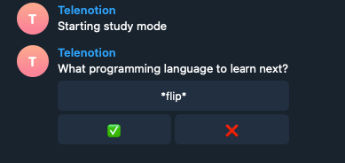
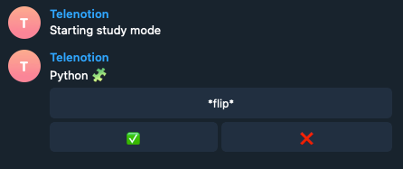

# Notion flashcard bot

Telegram bot built with [Notion API](https://developers.notion.com/) 
that helps you learn stuff by converting Notion bullet points to flashcards.

# Releases

+ 1.0.0 - MVP 

## Contributing
If you can understand what is going in the project, feel free
to contribute but first open an issue to ensure that nobody is doing the same feature

## License
[MIT](https://choosealicense.com/licenses/mit/)